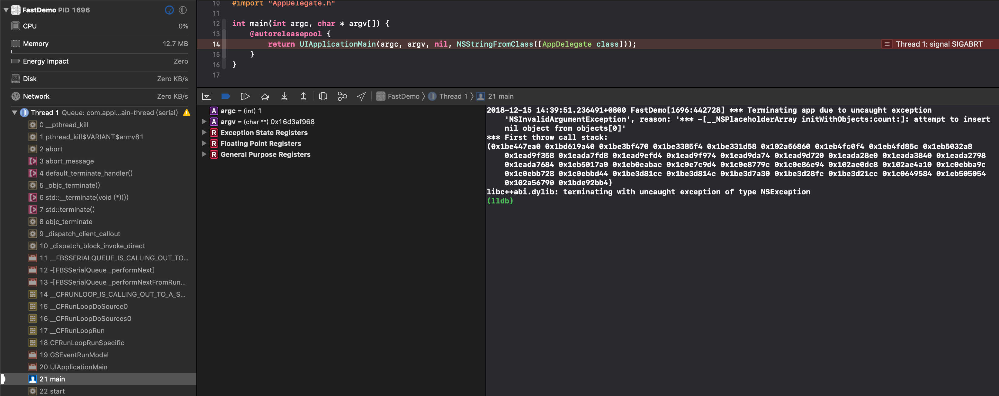
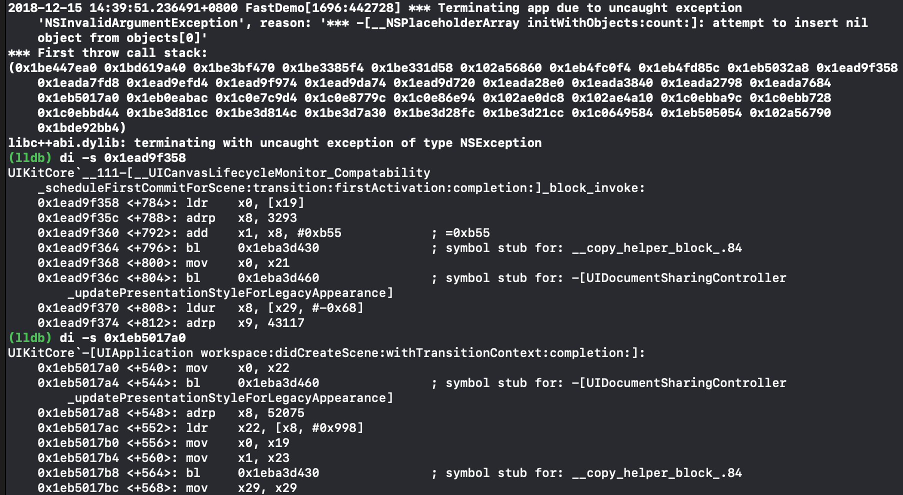
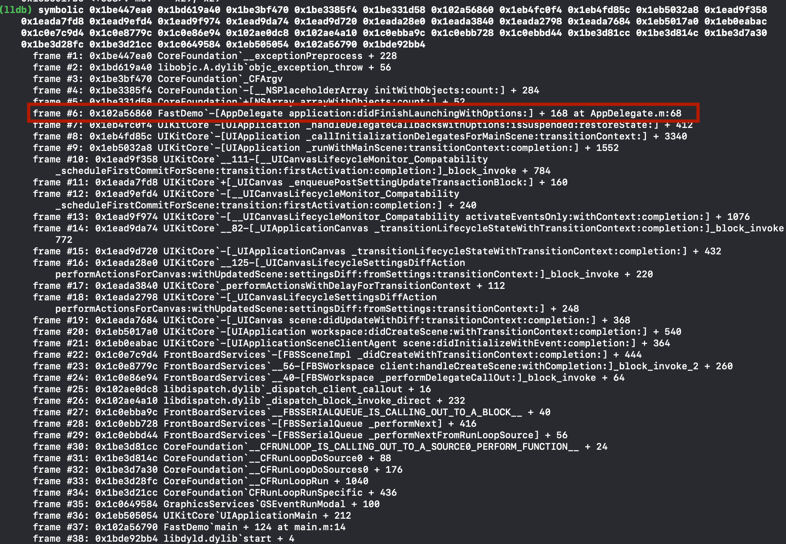
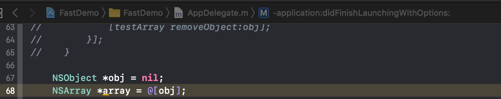

## 背景
对开发来说，我们时常需要处理不同bug, 其中最重要的一种便是crash。 对线上的crash来说，我们有fabric等工具会采集到crash。而在开发阶段，我们也经常会遇到项目发生异常crash。如下图：

图示的crash，并没有很好的符号化，因为是异常，此时 `bt`的线程堆栈也失去了现场。而且，对于开发调试阶段的crash，一般来说线上也不会采集（不应该采集），所以从线上查看开发阶段的crash也是不可能的。

### 碰到这样的问题有下面几种方式：

#### 1. 开发阶段发现的异常，重启并打异常断点来定位问题：

这种做法，对于必现的crash，是有效的方式。但是程序的运行环境时常是复杂的，有许多问题，只是偶现和难以复现的，重启不一定能很好复现bug， 因此这种做法存在丢失现场的问题，并不推荐

#### 2. 根据console的log，使用`di -s <address>`来查看堆栈

项目遇到异常crash，在真机调试的环境中，console给出的log并不是很友好， 这也是RD使用方式1来解决问题的原因。`first throw stack()`里是异常的callstack, 使用真机开发时，这里往往是一堆内存地址，对这里的地址使用 `di -s <address>`可以看到这个地址下的汇编，以及所在方法，如图：

然而，这种方式比较繁琐，需要逐个尝试

#### 3. 在2的基础上，用工具化的方式来解决问题

对于2的方式，可以更进一步，把重复的劳动工具化，于是我写了个lldb 命令`symbolic`来做这个事情。

使用方式是，安装`chisel`, 并将该脚本放在`/usr/local/opt/chisel/libexec/commands`目录下。从此lldb命令里多了`symbolic`, 使用时将要符号化的地址传入便可以，如图：

如图有了符号化信息，appdelegate.m:68行的位置发生了异常。

